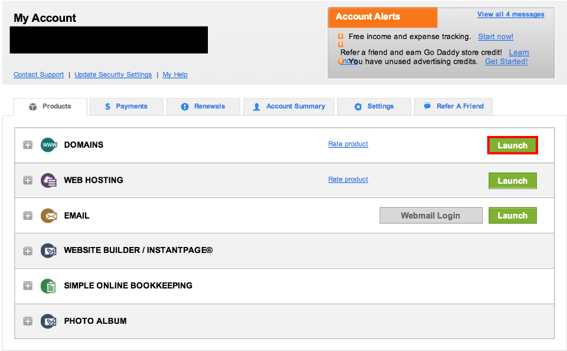
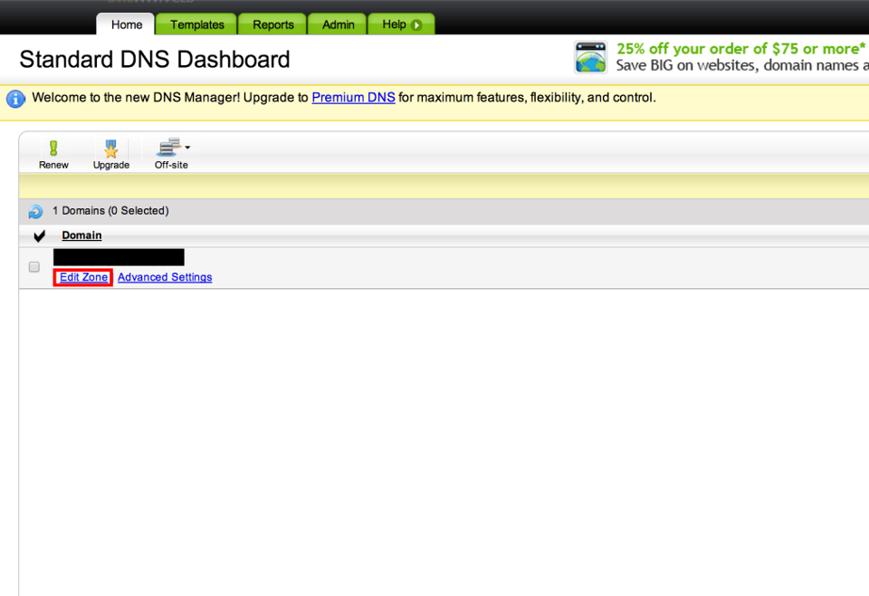
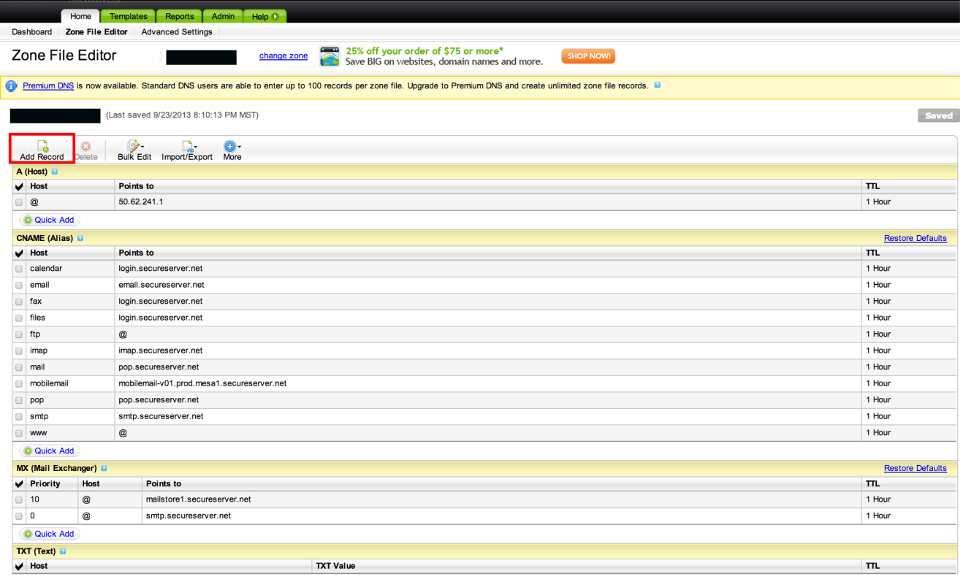
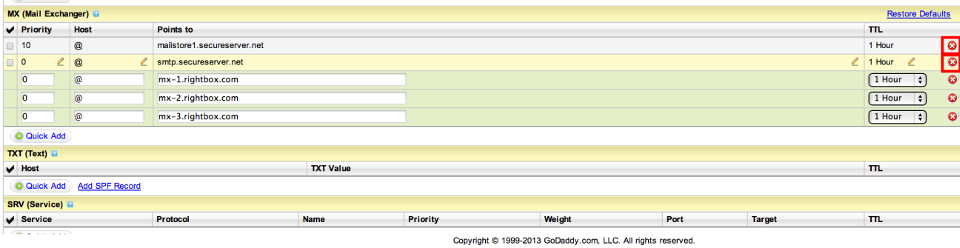
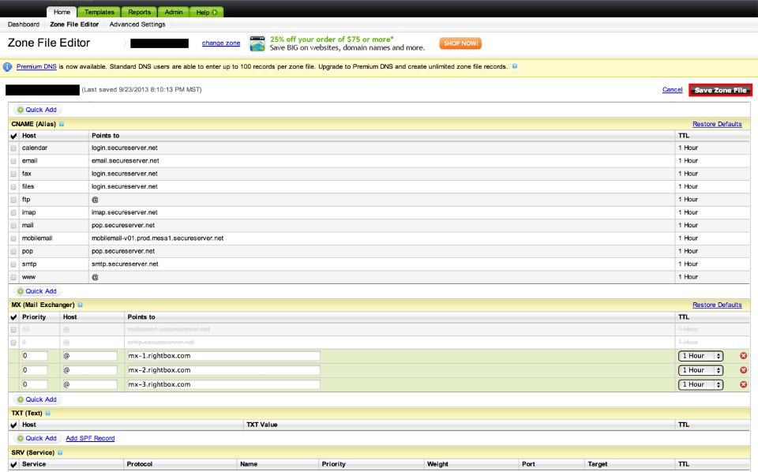

## Add MX Forwarding Records to your Godaddy.com Hostname

Instructions for adding MX forwarding records to your godaddy.com hostname.

Originally written by [@bchartoff](/bchartoff), as an accompaniment for [@konklone](/konklone)'s guide to [Taking Control of your Email Address](https://konklone.com/post/take-control-of-your-email-address).

1. Go to the godaddy account manager page at <http://mya.godaddy.com>, and log in to your account.

2. To the right of 'Domains', click 'Launch'.

    

3. From the 'DNS' drop down menu, select 'DNS Manager'.

    

4. The DNS Dashboard will show a list of your domains (only one is listed in this example screenshot). For the domain you'd like to change the MX records, click 'Edit Zone'.

	

5. Click 'Add Record'.

	

5. An 'Add DNS Record' window will pop up. In the 'Record Type' drop down menu, select 'MX (Mail Exchanger)'

	

6. In the 'Host Name' field you will almost always want to enter only a single '@' character. This field determines which domain the MX record refers to. An '@' character routes mail through the domain you selected in step 4. The only reason to enter anything else is if you'd like to route through a subdomain (e.g. ftp.mydomain.com or support.mydomain.com). If you really want to do this, enter the subdomain name under 'Host Name' (in the previous examples, 'ftp' or 'support').

7. In the 'Enter Go To Address' enter the name of an MX record you want to add. Leave all other fields at their default settings.

	

8. Repeat steps 5-7 for all MX records.

9. Delete your old MX records by clicking the red X icons to the right of their names.

	
	
9. Delete your old MX records by clicking the red X icons to the right of their names.

	
		
9. Delete your old MX records by clicking the red X icons to the right of their names.

	
	
10. Click the 'Save Zone File' button.

	
	
11. Click 'OK' twice, log out, and you're done!

