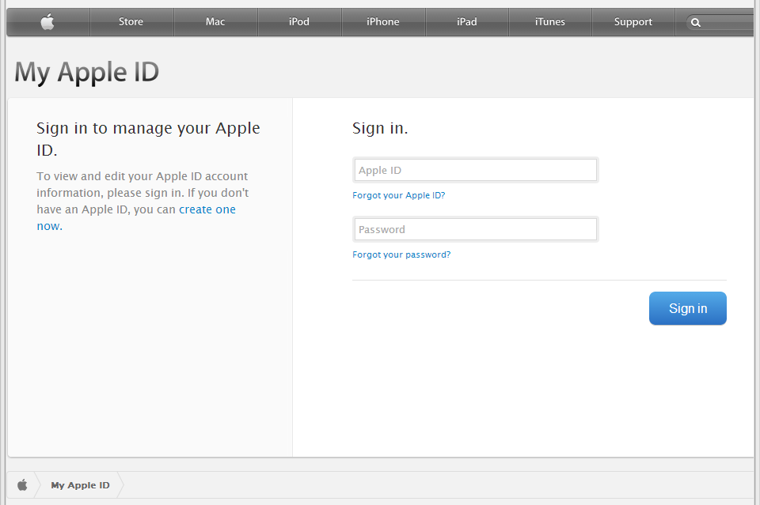
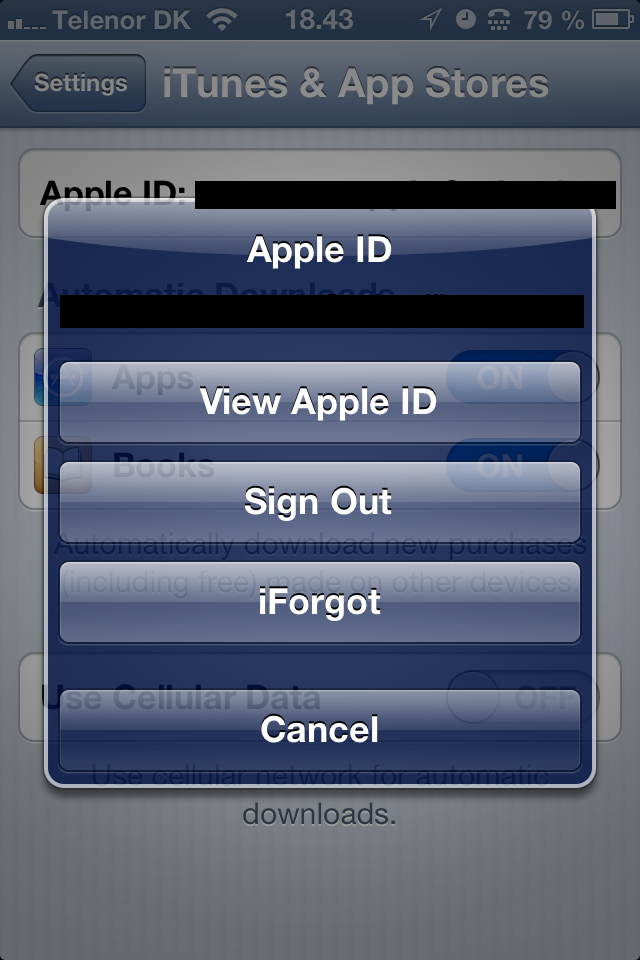
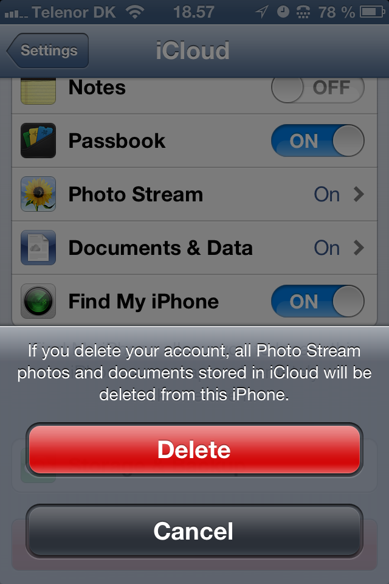
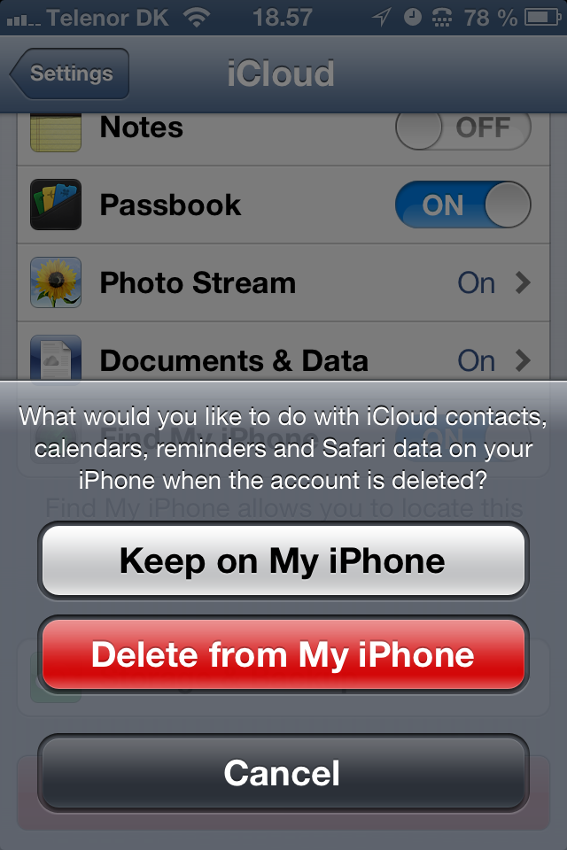
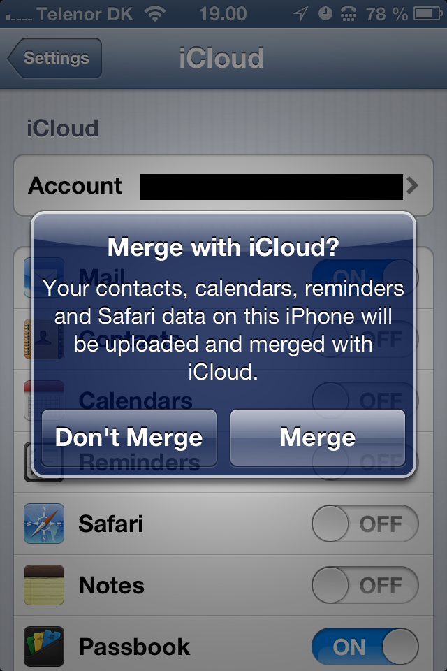

## Apple / iCloud Email Change

Instructions for updating your email address as your Apple ID and in iCloud. An accompaniment for [@konklone](/konklone)'s guide to [Taking Control of your Email Address](https://konklone.com/post/take-control-of-your-email-address).

Originally written by [@ndarville](/ndarville).

## Change Your Apple ID E-Mail

1. Go to <https://appleid.apple.com>.

2. Go to "Manage your Apple ID".

    

3. Log in with your old e-mail.

    

4. Click "Edit" under the heading "Apple ID and Primary Email Address" and enter the new e-mail address.

    

5. (Jump through the hoops of confirming the change. Can't remember what this entails; I think it's just a matter of clicking a confirmation e-mail.)

6. Before your close the tab, consider adding your old e-mail address to the list of "Alternate Email Addresses". This can prevent you from breaking anything that still relies on your old e-mail. (You never know with these things.)

## Change Your iTunes E-Mail

### Mac OS X/Windows

In iTunes for Mac OS X or Windows, just navigate to an iTunes Store pane where you can log out. Then, log in with your new e-mail address.

### iOS

1. In Settings, go to "iTunes & App Stores".

2. Click your (old) e-mail address in the top.

    

3. Sign out.

    

4. Sign in with your new e-mail address.

## Change Your iCloud E-Mail

**NB:** In my case, my bookmarks and Reading List items disappeared for a day, until they returned. Don't worry about losing them for good, but if you really rely on them, set aside an extra day for them to return.

1. In Settings, go to, you guessed it, "iCloud".

2. At the very bottom, click the big, fat, red "Delete Account" button. (Don't worry, you'll get a prompt afterwards.)

    

3. How about we just keep the data.

    

4. After iOS finishes the job, log back in with your new e-mail.

5. Choose Merge (because why not).

    

6. You'd think you were done, BUT, for some reason, when you go through this process, the iCloud Backup option is turned off at the end of this operation.

    If you want to back up directly to iCloud from the device, be sure to (re-)enable it under Storage & Backup under the iCloud section.

    

"It just works." (There's definitely room for improvement in this process.)
