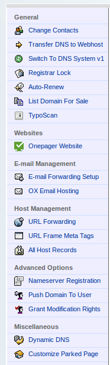

## Setting up Email Forwarding in Namecheap

Instructions for setting up email forwarding, by adding MX forwarding records to your domain name you registered with Namecheap.

Originally written by [Michael Weinberg](https://twitter.com/mweinbergPK) from [Public Knowledge](http://publicknowledge.org), as an accompaniment for [@konklone](/konklone)'s guide to [Taking Control of your Email Address](https://konklone.com/post/take-control-of-your-email-address).

1. Visit [Namecheap](http://www.namecheap.com) and log in to your domain configuration area, then click on "All Host Records" on the sidebar (pictured below).

    

2. Then, scroll down to Mail Settings, choose "User (Mail Server's Host Name Required)", and fill in the three MX records for Pobox in the form below. Each line needs "@" for the Host Name. Each Pobox MX record domain goes in the Mailserver Host Name field.

    